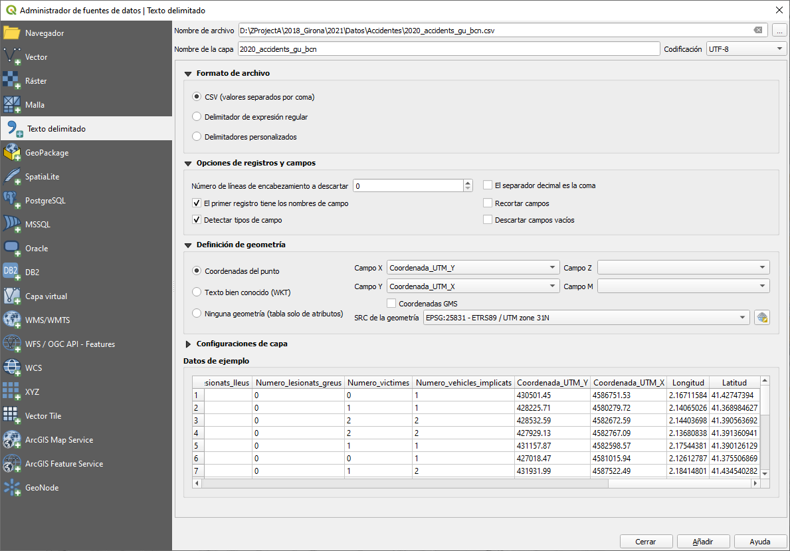

# TALLER QGIS JORNADAS SIG LIBRE GIRONA 2021
## MAPAS QUE CAMBIAN CON EL TIEMPO

## RESUMEN
En este taller vamos a ver diversas opciones para manejar el tiempo en los mapas
1. Lo utilizaremos en la **calculadora de campos**
2. Luego lo utilizaremos en el Panel "**Time Manager**" (Panel Controlador temporal)
3. **Atlas** para exportar serie de imágenes

#### DESCARGAR ACCIDENTES DE BARCELONA DEL 2020
Accidentes gestionados por la Guardía Urbana en la ciudad de Barcelona.
Incorpora el número de lesionados segun gravedad, el número de vehículos y el punto de impacto.
#### Descargar CSV del 2020
https://opendata-ajuntament.barcelona.cat/data/es/dataset/accidents-gu-bcn

Inmediatamente convertir la capa en formato **GeoPackage**

## Abrimos QGIS y cargamos el CSV como Texto Delimitado

# 1- CALCULADORA DE CAMPOS
Primero abrimos la tabla de atributos para ietificar que valores podemos utilizar.
Detectar que campos podemos utilizar para crear un campo de tipo **fecha** (date)

### Crear un campo nuevo con el nombre [fecha] de tipo "fecha", y utilizamos la siguiente expresión para asignarle el valor de fecha correspondiente
<code>make_date(  "NK_Any" , "Mes_any" , "Dia_mes" )</code>

### Crear otro campo nuevo con el nombre [fecha_fin] de tipo "fecha", y calcularemos la fecha 15 después de la fecha del accidentes
<code>"fecha" +  to_interval( '15 day')</code>

### Crear otro campo nuevo con el nombre [dia_anyo] de tipo "entero", y calcularemos el día del año, a partir del 1 de enero del 2020
<code>day(age("fecha" ,  to_date( '2020-01-01')))</code>
